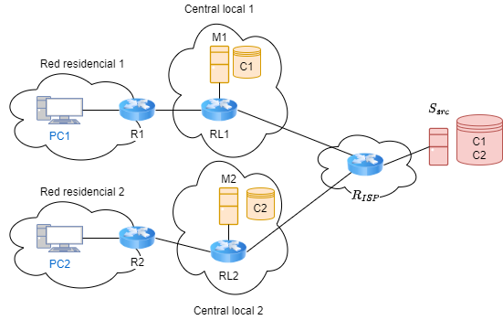

# Escenarios de redes de distribución de contenidos
## Descripción
El objetivo de este mini-proyecto es desarrollar un escenario de red de distribución de contenidos (CDN) basado en proyectos como Apache Traffic Control y Apache Traffic Server. El escenario de red deberá desplegarse utilizando la herramienta de virtualización Virtual Networks over Linux (VNX). Como resultado del proyecto se espera un escenario que permita analizar el plano de control de una CDN.

## Diseño del escenario


## Funcionamiento
### 1. Clonar el repositorio y levantar el escenario

```
git clone https://github.com/phernandez024/MPRO-CDN
```
```
cd MPRO-CDN
sudo vnx -f scenario.xml --create
```
### 2. Instalar ATS en la imagen VNX

- Parar los escenarios VNX (con el escenario destruido).
- Arrancar la imagen en modo directo con:

```
vnx --modify-rootfs /usr/share/vnx/filesystems/vnx_rootfs_lxc_ubuntu64-20.04-v025-vnxlab/
```

- Instalamos ATS
  
```
sudo apt update
sudo apt install trafficserver
halt -p
```

- Relanzamos el escenario y modificamos archivos de ATS en M3 y M4:
- En M3:

```
cd /etc/trafficserver
nano records.config
//modificar puerto para que escuche en el 80
nano remap.config
map http://200.200.200.2/ http://10.6.0.2/
```

- En M4:

```
cd /etc/trafficserver
nano records.config
//modificar puerto para que escuche en el 80
nano remap.config
map http://200.200.200.2/ http://10.7.0.2/
```

- Verificar que el servicio de Apache2 está activo en M1 y M2

### 3. Lanzamos petición para obtener el contenido 

- Desde alguno de los PCs ejecutamos el siguiente comando para solicitar el contenido deseado de el Servidor Origen. Pero ya que queremos que ATS haga mapeo de las peticiones hacia los servidores espejo (M1 y M2), es necesario simular un proxy que redirija el tráfico hacia los servidores que contienen ATS (M3 y M4).

```
wget --proxy=on --execute="http_proxy=http://10.5.0.2" http://200.200.200.2/imagen.jpg
```

### Profesor: Carlos M. Lentisco Sánchez

